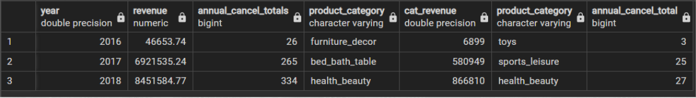

# Analyzing eCommerce Business Performance with SQL
Within a company measuring business performance is very important to track, monitor and evaluate success or failure from every business process. 
Therefore, this paper will analyze business performance of a eCommerce company by taking account several business metrics i.e. customers activity growth, 
product quality, and payment method.

# Prerequisites

1. Dataset download [`here`](https://drive.google.com/file/d/1X8V5mEAvJUqF5yXvv394_GG8E66UMEvJ/view?usp=sharing).

   
# Data Preparation
## About the Dataset
This dataset is owned by one of the big North American Ecommerce Companies. This company aims to connect micro-enterprises with their customers. 
This dataset contains over 99440 transaction record from 2016 up to 2018.

## Preparation Process
1. In this data preparation stage, there are several steps e.i.
2. For starter, install [`postgresql`](https://www.postgresql.org/).
3. After some configuration, open pgAdmin to access the tools.
4. Create a new database by secondary click on the Databases > Create > Database… then enter the name of the new database. I use ‘Project_Ecommerce’ as the database name.
5. Create the tables for each datasets using syntax CREATE TABLE, also determine the most suitable data type is necessary in here or you might get an error in the next step.
6. Import every datasets by secondary click on table name (You can find the tables in Schemas) and click Import/Export Data.There are 8 datasets in this project. P.s. you can also use COPY to import datasets if necessary.
7. Use ALTER TABLE to add CONSTRAINT be it primary key or foreign key. P.s. setting primary key or foreign key can also be done in create table step.
8. Make ERD by secondary click on ‘Project_Ecommerce’ and click Generate ERD.

# Annual Customer Activity Growth Analysis

    

- Column avg_mcag represents the average of Monthly Active Users.
- Column new_customer represents the number of new customers (the users who just made their first transaction).
- Column cust_repeat_order represents the opposite of new customers, this column is the number of customers that has been repeating order.
- Column avg_order represents the average frequency of number of orders.

    

From graph above, as we can see that every year the average monthly activity increased. Especially in 2017 the number increased significantly up to 3.300%. 
It might be because in 2016 the transactions only start from September, which mean only four months recorded.

    

As the causal correlation between Average Monthly Activity per Year graph and Number of New Customers per Year, the new customers has grown in the last 2 year (2016-2018).

    

    

From both graphs above, although we know that the customers increased year by year, the order frequency in 2018 is declining. Most users only order once. 

# Annual Product Category Quality Analysis

    

- Column revenue represents the total revenue each for year.
- Column annual_cancel_totals represents the number of canceled orders each year.
- Column product_category represents the product category of the column next to it.
- Column cat_revenue represents the total revenue of the product category which obtained the highest revenue of the year.
- Column annual_cancel_total represents the canceled number of the most canceled product of the year.

    

    

From the graphs above, both represents the revenue that has been acquired each years from 2016 - 2018. The revenue has grown year by year and for 
the top product in 2016, furniture_decor obtained the highest revenue with an achievement of 6899, as for 2017, bed_bath_table obtained 580949 and 2018, 
health_beauty obtained 866810. 

    

    

Simultaneously with revenue growth , total cancellations also increased year after year. In 2016, toys product category has been cancelled for 3 times, 
in 2017 sport_leisure has been cancelled for 25 times, and in 2018, although health_beauty received the most highest revenue but it’s also placed as the 
most cancelled product category with 27 number of cancellations.

# Analysis of Annual Payment Type Usage

    

- Column payment_type represents the payment method that users used to pay the bill.
- Column y2016, y2017, y2018 the year in which payment was done.
- Column total_payment represents how many times the payment type was used.

    

    

credit card is the most used payment type followed by boleto, voucher and debit card, but there are 3 not defined payment type which caused by 
cancellations hence the payment is not valid and never happened. On the right graph, almost every payment types increased year after year except 
for voucher the payment total was decreased in 2018 but it’s not very significant and it might be caused by the availability of the issued vouchers.

# Conclusion and Summary

- Annual Customer Activity Growth increases quite significantly every year, but the tendency is for customers to only make one transaction and not make another order, which means most customers just join and stay as a new customer category. This may be due to the attractive promos offered at the beginning, so the company can provide promos/discounts, send recommendations for products that have been purchased, add a repeat order feature in the order history.
- From Annual Product Category Quality Analysis, the highest revenue comes from health_beauty in 2018, bed_bath_table in 2017 and furniture_decor in 2016. health_beauty occupied both highest revenue and most cancelled positions. Further survey regarding cancellation reason is needed in order to minimize the total cancellations which increased every year and to improve the company revenue.
- The most used payment type is credit card hence consider collaborating with bank to promote new program such as low interest rate, etc.

